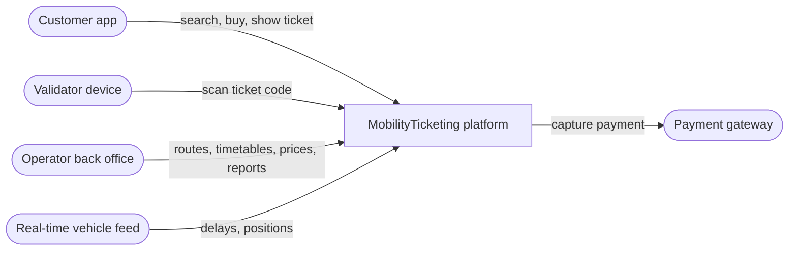
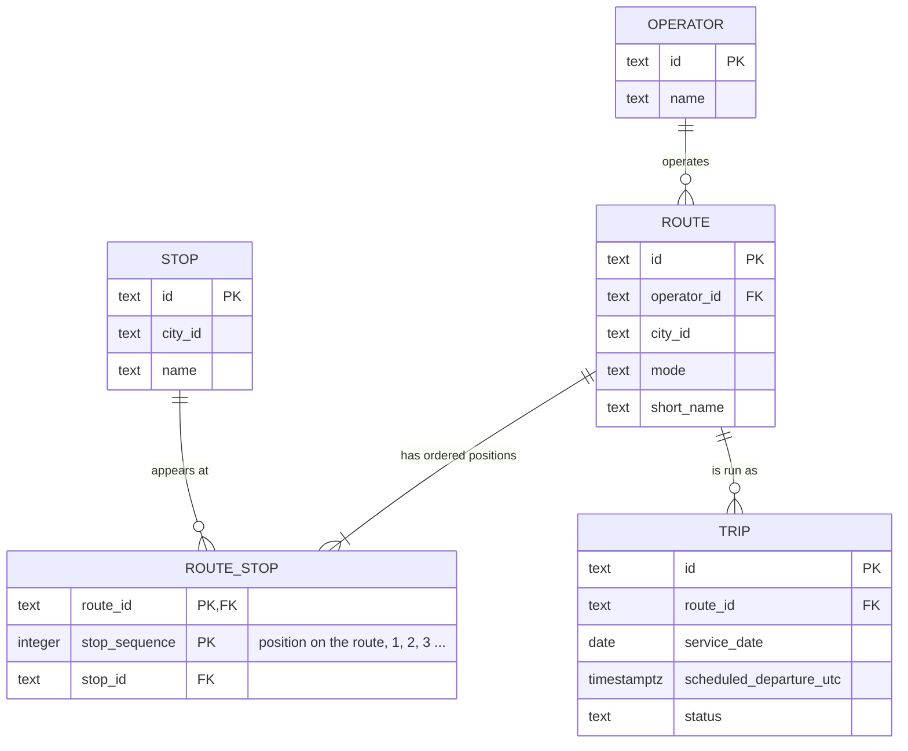

# Lecture 1: Relational baseline for routes and timetables

The smallest relational model that supports route maintenance and upcoming-trip queries.

| What | Where |
| --- | --- |
| Schema | [`init/001_relational_baseline.sql`](../../../database/postgres/init/001_relational_baseline.sql) |
| Seed data: operators, routes, stops, route stops | [`init/002_seed.sql`](../../../database/postgres/init/002_seed.sql) |
| Seed data: trips (two per route on 29 April) | [`init/011_ticketing_seed.sql`](../../../database/postgres/init/011_ticketing_seed.sql), see the note below |
| The three workload queries | [`queries/003_queries.sql.example`](../../../database/postgres/queries/003_queries.sql.example) |
| Zero-trip routes, ON vs WHERE | [`experiments/lecture01/zero_trip_routes.sql`](../../../database/postgres/experiments/lecture01/zero_trip_routes.sql) |
| A route that revisits a stop | [`experiments/lecture01/route_revisits_stop.sql`](../../../database/postgres/experiments/lecture01/route_revisits_stop.sql) |

**Where the trips come from.** In week 1 we seeded our own four trips in `002_seed.sql`. The lecture 2 starter seeds the trips in `011_ticketing_seed.sql` instead, with `capacity` and `reserved_seats`. It reuses the id `TRIP-M2-20260429-0800` with a different departure time, and its tickets refer to trips ours did not have (`TRIP-5C-20260429-0900`). Keeping both would have left one row with our time and no capacity. So `002_seed.sql` now matches the starter, and all trips come from `011`. The week 1 version is in the commit "week 35 assignment".

## Reproduce

```bash
sh scripts/db-reset.sh 000
docker compose exec -T postgres psql -U mobility -d mobility \
  -v route_id="'LINE-M2'" -v after_utc="'2026-04-29T09:00:00Z'" -v service_date="'2026-04-29'" \
  < database/postgres/queries/003_queries.sql.example
docker compose exec -T postgres psql -U mobility -d mobility < database/postgres/experiments/lecture01/zero_trip_routes.sql
docker compose exec -T postgres psql -U mobility -d mobility < database/postgres/experiments/lecture01/route_revisits_stop.sql
docker compose exec -T postgres psql -U mobility -d mobility < database/postgres/init/002_seed.sql
```

The queries file uses `:name` placeholders. psql fills them from `-v` without adding quotes, so each value carries its own quotes. Both experiments roll back. The last command loads the seed a second time, to show it can be repeated.

## System context

The platform sells and checks tickets for buses, trams and trains in one city. **Customers** search for journeys, look at departures and delays, buy digital tickets on their phone and show them when boarding. **Operators**, the companies running the lines, maintain their routes and timetables, set products and prices, and follow usage and revenue. Around the platform are a **payment gateway** that captures card payments, **validator devices** on vehicles and at stops that scan tickets, and a **real-time feed** of vehicle positions and delays. Load is uneven: searches, purchases and validations peak twice a day at rush hour, while timetable changes and reports are occasional.



## Workload map

| Workload | Who | Reads | Writes | Frequency | Latency | Staleness tolerated | Where in this repository |
| --- | --- | --- | --- | --- | --- | --- | --- |
| Journey search | Customer | routes, route stops, stops, trips, prices, availability | – | Very high, rush-hour peaks | Low | Some: a slightly old timetable or seat count is acceptable if the options are still useful | Lecture 1 queries 1–2 |
| Ticket purchase | Customer | trip (sellable, seats left), product (price), user | ticket, payment, seat counter | High at peaks | Moderate | None for the sell decision and the payment | Lecture 2 constraints, [boundaries](../lecture02/README.md#rules-a-constraint-cannot-solve) |
| Ticket validation | Validator device | ticket by code | validation (and ticket status) | Very high while boarding | Low: the passenger is waiting | None for the ticket's own state. Reporting may lag | Lecture 2 composite key on validations |
| Timetable maintenance | Operator | routes, route stops, trips | routes, route stops, trips (a whole route's timetable may be replaced) | Low, in batches | Relaxed | Changes must *eventually* reach search | Lecture 1 schema, query 3 |
| Real-time availability | Customer, search | remaining capacity | changed by purchases | Read far more than written | Low | Approximate for search, exact for purchase | `trips.reserved_seats` (lecture 2, Issue 1) |
| Reporting | Operator | tickets, payments, validations history | derived aggregates | Periodic | Tolerant | Yes: reports need not show every write at once, but must reconcile | [Lecture 3](../lecture03/README.md) |

## Relational model



- An operator runs zero or more routes, and every route belongs to exactly one operator.
- A route has an ordered list of positions, and each position holds one stop. A stop can appear at many positions, on several routes or twice on the same route.
- A route is run as zero or more trips, and each trip belongs to one route.

The ticketing entities added in lecture 2 are in the [lecture 2 model](../lecture02/README.md#model-after-lecture-2).

### The route-stop key

`primary key (route_id, stop_sequence)`: a row is a **position on a route**, not a stop. A route may visit the same stop more than once (a loop line, or a line that passes an interchange twice), so `(route_id, stop_id)` would reject real routes. The position is what is unique per route.

```text
== LINE-5C returns to Copenhagen Central Station as its fourth stop
 route_id |       stop_id       | stop_sequence
----------+---------------------+---------------
 LINE-5C  | STOP-CENTRAL        |             1
 LINE-5C  | STOP-NORREPORT      |             2
 LINE-5C  | STOP-KONGENS-NYTORV |             3
 LINE-5C  | STOP-CENTRAL        |             4
== A second stop at the same position
ERROR:  duplicate key value violates unique constraint "route_stops_pk"
DETAIL:  Key (route_id, stop_sequence)=(LINE-5C, 4) already exists.
```

We kept only the primary key. A separate `unique (route_id, stop_sequence)` would check exactly the same thing again.

### Functional dependency

In `route_stops`, **`(route_id, stop_sequence) → stop_id`**: a route and a position determine the stop. Neither column alone does. `LINE-M2` has three different stops, and position 1 means different stops on different routes. So `stop_id` depends on the whole key.

The stop's own facts depend only on the stop: `stop_id → name, city_id`. That is why the name lives in `stops`. If `route_stops` also stored the stop name, the name would depend on the key only through `stop_id`, a transitive dependency. Normalization keeps the name in one place and prevents:

- **update anomalies**: Nørreport appears at two positions (LINE-M2 position 1 and LINE-5C position 2). Renaming it in one row but not the other would give one stop two names.
- **insertion anomalies**: a new stop could not be recorded before some route used it.
- **deletion anomalies**: removing the last route through a stop would also delete the only record of the stop.

### How a query uses the model

Query 2 (ordered stops for a route) reads `route_stops` by `route_id` and sorts by `stop_sequence`. That only works because each row is a *position*. The sort gives the route in travel order, and on a loop route the repeated stop appears once per position, exactly where the vehicle passes it. The stop name comes from joining `stops`, following the functional dependency above, instead of a copy stored per position. Query 3 uses the `route → trip` relationship with a `left join`, so a route with no trips on the date still appears (see [the results](#query-results)).

### One assumption that may change

**A route is one fixed, ordered list of stops, and a trip only records when it leaves the first stop.** Journey search between two stops needs the time at *every* stop, and real lines have variants: two directions, short trips, express services. We expect a per-stop schedule table keyed by `(trip_id, stop_sequence)`, referencing `route_stops (route_id, stop_sequence)`. The position-based key chosen above is what makes that reference possible.

### Schema compared with the ER diagram

| Difference | Why it matters |
| --- | --- |
| The ER diagram says a route has **one or more** positions. The schema allows a route with none | "At least one child row" cannot be written as a simple constraint. Something outside the schema would have to enforce it, for example the timetable maintenance code |
| City is an attribute (`city_id` text) on routes and stops, not an entity | Nothing stops a typo such as `CPN`, and nothing checks that a route and its stops are in the same city |
| `mode` and `trips.status` are free text in lecture 1 | Lecture 2 added `trips_status_known`. `mode` is still unchecked |
| Vehicles are part of the domain but not of the model | Trips are not tied to vehicles yet, so capacity sits on the trip (lecture 2) |
| `stop_sequence > 0` is in the schema only | The diagram does not show check constraints |

Otherwise the implementation matches the diagram: the same identifiers, route stops identified by route and position, and a single operator per route and a single route per trip, both enforced by `not null` foreign keys.

## Query results

The queries file run as in [Reproduce](#reproduce), for `LINE-M2` after 09:00 UTC on 29 April:

```text
          id           | scheduled_departure_utc |  status
-----------------------+-------------------------+-----------
 TRIP-M2-20260429-1200 | 2026-04-29 12:00:00+00  | Scheduled

 stop_sequence |       stop_id       |        name
---------------+---------------------+--------------------
             1 | STOP-NORREPORT      | Nørreport
             2 | STOP-KONGENS-NYTORV | Kongens Nytorv
             3 | STOP-AIRPORT        | Copenhagen Airport

   id    | short_name | scheduled_trip_count
---------+------------+----------------------
 LINE-5C | 5C         |                    2
 LINE-M2 | M2         |                    2
```

Query 1 leaves out the 08:00 departure because it is before the supplied timestamp. It also filters on `status = 'Scheduled'`. The starter version did not, but the workload asks for the next *scheduled* trips, and query 3 counts only scheduled trips too. A cancelled departure is not an upcoming trip.

To show a route with **no** trips, `zero_trip_routes.sql` cancels LINE-5C's trips inside a rolled-back transaction:

```text
== Query 1 for LINE-5C: cancelled trips are not upcoming trips
 id | scheduled_departure_utc | status
----+-------------------------+--------
(0 rows)

== Date and status filters in the ON clause, as in queries/003_queries.sql.example
   id    | short_name | scheduled_trip_count
---------+------------+----------------------
 LINE-5C | 5C         |                    0
 LINE-M2 | M2         |                    2

== The same filters moved to WHERE
   id    | short_name | scheduled_trip_count
---------+------------+----------------------
 LINE-M2 | M2         |                    2
```

With the filters in `WHERE`, the route without trips disappears. Its joined trip columns are `NULL`, `NULL = '2026-04-29'` is not true, and the `left join` ends up behaving like an inner join. `count(t.id)` rather than `count(*)` is what makes the remaining route count 0 instead of 1.

## What the implementation proves, and what it does not

It proves that the schema can be rebuilt from an empty database (`sh scripts/db-reset.sh 000`), and that the seed can be loaded again without changes. Running `002_seed.sql` a second time gives `INSERT 0 0` four times. The trips seed in `011_ticketing_seed.sql` also uses `on conflict do nothing`. It proves that the three queries answer their workloads, including routes with no trips, and that the key allows loop routes but not two stops at one position.

It does not tell us how the queries behave with real data volumes (no indexes yet, by design), how directions and route variants should be modelled, or how a whole timetable is replaced without search seeing a half-updated route. It also leaves open which calendar `service_date` refers to for a night bus that departs after midnight.
