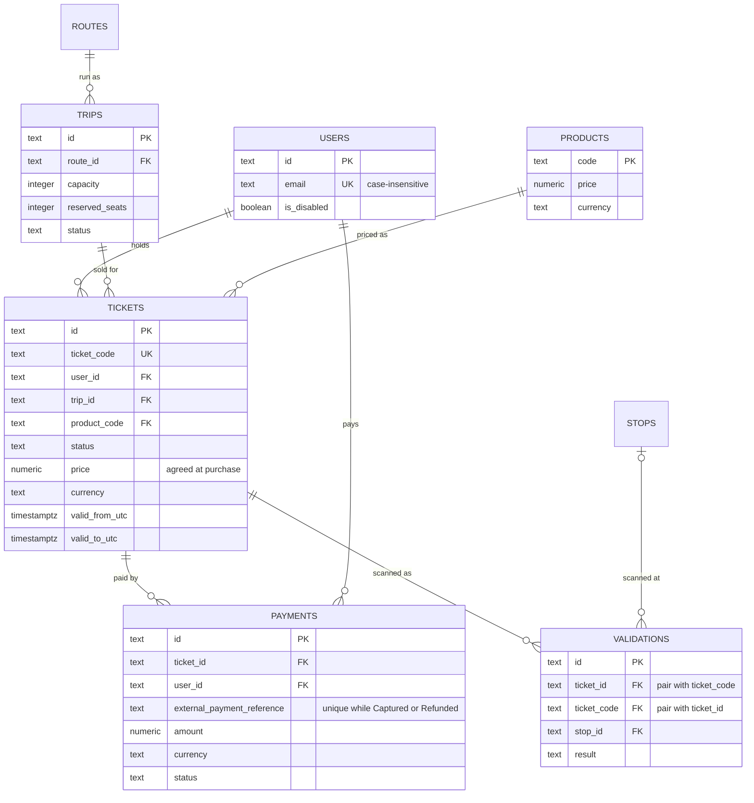

# Lecture 2: Make invalid states difficult to store

The starter ticketing schema ([`010_ticketing_draft.sql`](../../../database/postgres/init/010_ticketing_draft.sql)) has almost no rules. This lecture adds the rules the database itself can guarantee, whichever application or script does the writing.

| What | Where |
| --- | --- |
| Constraint migration | [`migrations/011_ticketing_integrity.sql`](../../../database/postgres/migrations/011_ticketing_integrity.sql) |
| Automated tests (SQLSTATE + constraint name) | [`tests/011_ticketing_integrity_test.sql`](../../../database/postgres/tests/011_ticketing_integrity_test.sql) |
| Starter negative writes | [`experiments/lecture02/constraints_should_fail.sql`](../../../database/postgres/experiments/lecture02/constraints_should_fail.sql) |
| Seat counter check | [`experiments/lecture02/seat_counter_drift.sql`](../../../database/postgres/experiments/lecture02/seat_counter_drift.sql) |
| Integrity map, issue register, state-transition trace | [`integrity-map.md`](integrity-map.md) |

## Reproduce

After the migration:

```bash
sh scripts/db-reset.sh 011
docker compose exec -T postgres psql -U mobility -d mobility -v ON_ERROR_STOP=1 < database/postgres/tests/011_ticketing_integrity_test.sql
docker compose exec -T postgres psql -U mobility -d mobility < database/postgres/experiments/lecture02/constraints_should_fail.sql
```

The "before" run below uses the schema without the migration. `constraints_should_fail.sql` has no transaction of its own, so it is wrapped in one that rolls back:

```bash
sh scripts/db-reset.sh 000
{ echo 'begin;'; cat database/postgres/experiments/lecture02/constraints_should_fail.sql; echo 'rollback;'; } | docker compose exec -T postgres psql -U mobility -d mobility
```

The test file (53 checks: 48 PASS lines for accepted and rejected writes, 5 GAP lines) runs in one transaction and rolls back, so it can be repeated. It exits with code 3 on the first failure. It works at migration levels 011–031 and refuses to run at 032, where tickets need a `product_id`. Against the schema without the migration (`sh scripts/db-reset.sh 000`), it stops at the first rule:

```text
PASS  capacity of zero -> accepted
PASS  reserved seats equal to capacity -> accepted
PASS  cancel a trip -> accepted
ERROR:  FAIL  negative capacity -> expected 23514 trips_capacity_non_negative, but the write was accepted
```

## Model after lecture 2



## Invariants and how they are classified

The 28 rules are numbered as in the [integrity map](integrity-map.md).

1. **Directly enforceable with a column or table constraint** (`NOT NULL`, `CHECK`, `FOREIGN KEY`): #1–#12.
2. **Enforceable with a unique or exclusion rule**: #13 ticket codes, #14 validation id/code pair (a unique key that exists to be a foreign-key target), #15 one gateway capture, #16 one account per e-mail.
3. **Depends on more than one row or an external system**: #17 concurrent purchases, #18 seat counter vs tickets, #19 purchase atomicity with the gateway, #20 amount vs price, #21 validation vs ticket state and time, #22 vehicle and device registry.
4. **Ambiguous, needs a domain decision**: #23 disabled users, #24 status transitions, #25 unknown-code scans, #26 payer vs holder, #27 changing a sold ticket's price, #28 day passes tied to one trip.

Some rules in groups 1 and 2 also contain a decision we had to make: the value sets in #3 and #8, and which statuses #15 covers.

## Before and after

The starter file's ten invalid writes, run against the weak schema inside `begin … rollback`:

```text
BEGIN
UPDATE 1
UPDATE 1
INSERT 0 1
INSERT 0 1
INSERT 0 1
UPDATE 1
UPDATE 1
INSERT 0 1
INSERT 0 1
INSERT 0 1
ROLLBACK
```

All ten were accepted. The same file after `011_ticketing_integrity.sql`:

```text
ERROR:  new row for relation "trips" violates check constraint "trips_capacity_non_negative"
ERROR:  new row for relation "trips" violates check constraint "trips_reserved_seats_within_capacity"
ERROR:  insert or update on table "tickets" violates foreign key constraint "tickets_trip_fk"
ERROR:  new row for relation "tickets" violates check constraint "tickets_validity_window"
ERROR:  duplicate key value violates unique constraint "tickets_ticket_code_unique"
ERROR:  new row for relation "tickets" violates check constraint "tickets_status_known"
ERROR:  new row for relation "products" violates check constraint "products_price_non_negative"
ERROR:  insert or update on table "payments" violates foreign key constraint "payments_ticket_fk"
ERROR:  duplicate key value violates unique constraint "payments_captured_reference_unique"
ERROR:  insert or update on table "validations" violates foreign key constraint "validations_ticket_fk"
```

The first case breaks two checks at once: capacity `-1` is negative, and `reserved_seats = 2` is above `-1`. PostgreSQL evaluates check constraints in name order, so the reported one is `trips_capacity_non_negative`.

## Test run

Each rejected write is matched on the SQLSTATE and the constraint (or, for `NOT NULL`, the column) that stopped it, not on the English error text.

```text
== Trips
PASS  capacity of zero -> accepted
PASS  reserved seats equal to capacity -> accepted
PASS  cancel a trip -> accepted
PASS  negative capacity -> 23514 trips_capacity_non_negative
PASS  more reserved seats than capacity -> 23514 trips_reserved_seats_within_capacity
PASS  negative reserved seats -> 23514 trips_reserved_seats_within_capacity
PASS  missing capacity -> 23502 capacity
PASS  missing reserved seats -> 23502 reserved_seats
PASS  unknown trip status -> 23514 trips_status_known
== Products
PASS  product with price and ISO currency -> accepted
PASS  negative product price -> 23514 products_price_non_negative
PASS  missing product price -> 23502 price
PASS  lower-case currency -> 23514 products_currency_iso_format
PASS  missing product currency -> 23502 currency
== Users
PASS  new user -> accepted
PASS  e-mail that differs only in letter case -> 23505 users_email_lower_unique
PASS  missing e-mail -> 23502 email
== Tickets
PASS  valid ticket -> accepted
PASS  ticket for an unknown trip -> 23503 tickets_trip_fk
PASS  ticket for an unknown user -> 23503 tickets_user_fk
PASS  ticket for an unknown product -> 23503 tickets_product_fk
PASS  validity window that ends before it starts -> 23514 tickets_validity_window
PASS  duplicate ticket code -> 23505 tickets_ticket_code_unique
PASS  unknown ticket status -> 23514 tickets_status_known
PASS  negative ticket price -> 23514 tickets_price_non_negative
PASS  two-letter ticket currency -> 23514 tickets_currency_iso_format
PASS  missing ticket code -> 23502 ticket_code
== Payments
PASS  pending payment before the gateway returns a reference -> accepted
PASS  captured payment with a new reference -> accepted
PASS  payment for an unknown ticket -> 23503 payments_ticket_fk
PASS  payment by an unknown user -> 23503 payments_user_fk
PASS  lower-case payment currency -> 23514 payments_currency_iso_format
PASS  negative payment amount -> 23514 payments_amount_non_negative
PASS  unknown payment status -> 23514 payments_status_known
PASS  captured payment without a gateway reference -> 23514 payments_captured_has_reference
PASS  same capture recorded twice -> 23505 payments_captured_reference_unique
PASS  refund updates the captured row -> accepted
PASS  capture delivered again after it was refunded -> 23505 payments_captured_reference_unique
PASS  failed attempt that reuses a captured reference (outside the index by design) -> accepted
== Deletes that would erase history
PASS  delete a ticket that has a payment -> 23503 payments_ticket_fk
PASS  delete a product that tickets were sold for -> 23503 tickets_product_fk
== Validations
PASS  validation whose code belongs to the ticket -> accepted
PASS  ticket id combined with the code of another ticket -> 23503 validations_ticket_fk
PASS  validation for an unknown ticket -> 23503 validations_ticket_fk
PASS  validation at an unknown stop -> 23503 validations_stop_fk
PASS  unknown validation result -> 23514 validations_result_known
PASS  validation without the scanned code -> 23502 ticket_code
== Boundaries: rules a constraint does not cover
GAP   seat counter no longer matches the tickets sold -> accepted, not protected by a constraint
GAP   price of a sold ticket rewritten afterwards -> accepted, not protected by a constraint
GAP   captured amount differs from the ticket price -> accepted, not protected by a constraint
GAP   accepted validation outside the ticket validity window -> accepted, not protected by a constraint
PASS  disable a user -> accepted
GAP   disabled user buys a ticket -> accepted, not protected by a constraint
All checks passed. Every change was rolled back.
```

## Two rules to discuss

### A validation's ticket id and code belong to the same ticket

```sql
alter table tickets
    add constraint tickets_id_ticket_code_unique unique (id, ticket_code);

alter table validations
    add constraint validations_ticket_fk
        foreign key (ticket_id, ticket_code) references tickets (id, ticket_code) on delete restrict;
```

- Valid write: `VAL-TEST-1` with `TICKET-1` and its own code `CODE-M2-0001` is accepted.
- Rejected write: `TICKET-1` with `CODE-5C-0001` (the code of `TICKET-2`) fails with `23503 validations_ticket_fk`. Two separate foreign keys, one on `ticket_id` and one on `ticket_code`, would both have accepted it, because each value exists on its own.
- What enforces it: the composite foreign key. It can only point at columns with a declared unique key, which is why `tickets_id_ticket_code_unique` exists even though `id` is already unique. Compare this with lecture 1, where a unique constraint on the primary-key columns was dead weight. Here the same kind of redundant key is needed as a foreign-key target.

### One gateway capture is recorded once

```sql
create unique index payments_captured_reference_unique
    on payments (external_payment_reference)
    where status in ('Captured', 'Refunded');
```

- Valid writes: a new capture with a new reference is accepted. A `Failed` attempt that reuses a captured reference is also accepted, on purpose.
- Rejected writes: the same capture delivered twice fails with `23505 payments_captured_reference_unique`. So does a late copy of `gateway-capture-0002` after `PAYMENT-2` was refunded.
- What enforces it: a partial unique index, not a table constraint. The error reports the index name.
- Alternatives we considered:
  - `unique (external_payment_reference)` on all rows would also reject duplicate failure notifications. It breaks if the gateway reuses one reference for several attempts at the same payment.
  - `where status = 'Captured'` alone would let a duplicate capture back in after a refund. Lecture 3 models a refund as a status change on the same row, so that row leaves a `Captured`-only index.
  - Which option is right depends on what the gateway's reference identifies. We have not confirmed that.

## Rules a constraint cannot solve

These are kept for the transactions lecture:

1. **Two purchases racing for the last seat (#17).** Both transactions read `reserved_seats = capacity - 1`. Each writes `capacity`, and each row passes `trips_reserved_seats_within_capacity`. The check never sees the other transaction. The purchase itself has to use a conditional update or a row lock.
2. **A purchase spans the gateway and the database (#19).** The capture happens outside PostgreSQL, so no constraint can make "money captured" and "ticket and payment rows exist" happen together. The unique capture reference (#15) makes a retried write safe to repeat, but reconciliation is still needed.
3. **The seat counter is a stored copy (#18).** The seed data already disagrees with the tickets (Issue 1 in the [integrity map](integrity-map.md#issue-register)):

```text
        trip_id        | capacity | reserved_seats | seat_holding_tickets
-----------------------+----------+----------------+----------------------
 TRIP-5C-20260429-0900 |       80 |              1 |                    1
 TRIP-5C-20260429-1700 |       80 |              0 |                    0
 TRIP-M2-20260429-0800 |      120 |              2 |                    1
 TRIP-M2-20260429-1200 |      120 |              0 |                    1
```

## Delete and update behaviour

| Relationship | On delete | Reason | Updates that change history |
| --- | --- | --- | --- |
| `tickets → users` | Restrict | Tickets and payments are history. Users are disabled with `is_disabled`, and personal data is handled by an anonymisation or retention policy, not by deleting rows | A user id never changes |
| `tickets → trips` | Restrict | A cancelled trip keeps its row with `status = 'Cancelled'` | Moving a sold ticket to another trip should be rejected (not enforced yet) |
| `tickets → products` | Restrict | Products are retired, not deleted | The catalogue price may change, because each ticket stores its own agreed price. Rewriting `tickets.price` should be rejected (#27, not enforced) |
| `payments → tickets`, `payments → users` | Restrict | Payments are accounting records with a legal retention period | Amount and currency are fixed after capture. A correction is a status change such as `Refunded` |
| `validations → tickets`, `validations → stops` | Restrict | Validations are an append-only log | Updates and deletes should be rejected (not enforced) |
| `route_stops`, `trips → routes` (lecture 1) | Blocked (default `no action`) | Replacing a timetable replaces `route_stops` rows. Routes and stops stay | – |

We wrote `on delete restrict` explicitly. It blocks the delete like the default `no action` does, but it is checked immediately and cannot be deferred, and it states the intent in the DDL. The two delete tests show it working. The "not enforced" update rules need a trigger or column privileges, which this lecture does not add.
