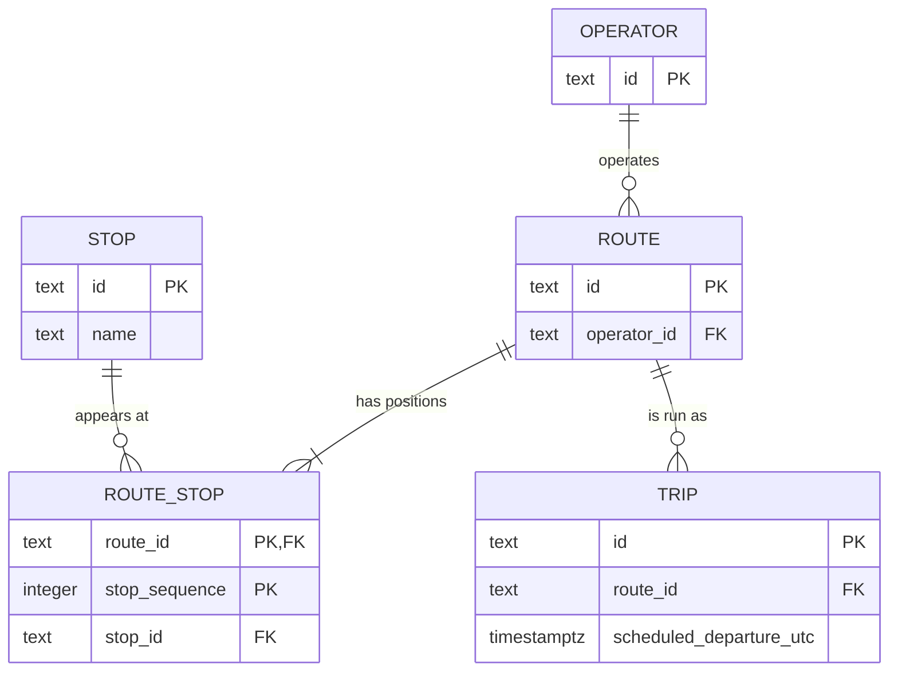

# Lecture 1: Routes and timetables

| What | File |
| --- | --- |
| Schema | [init/001_relational_baseline.sql](init/001_relational_baseline.sql) |
| Seed: operators, routes, stops, route stops | [init/002_seed.sql](init/002_seed.sql) |
| Seed: trips | [lecture02/init/011_ticketing_seed.sql](../lecture02/init/011_ticketing_seed.sql) |
| The three workload queries | [queries/003_queries.sql.example](queries/003_queries.sql.example) |
| Lab brief | [lab.md](lab.md) |

The trips moved to lecture 2's seed. That seed adds capacity to each trip and reuses our trip ids, so `002_seed.sql` now matches the starter's version.

## Reproduce

```bash
sh scripts/db-reset.sh 000
docker compose exec -T postgres psql -U mobility -d mobility \
  -v route_id="'LINE-M2'" -v after_utc="'2026-04-29T09:00:00Z'" -v service_date="'2026-04-29'" \
  < lecture01/queries/003_queries.sql.example
```

Each `-v` value carries its own quotes, because psql fills the `:name` placeholders as plain text. The schema is rebuilt from an empty database. Loading `002_seed.sql` a second time gives `INSERT 0 0` for every table.

## System context

Customers search for journeys, see departures and delays, buy tickets in an app and show them when boarding. Operators maintain routes, timetables, products and prices, and read usage and revenue reports. The platform also works with a payment gateway, validator devices on vehicles and a real-time vehicle feed. Searches, purchases and validations peak at rush hour. Timetable changes and reports are occasional.

## Workload map

| Workload | Reads | Writes | Latency | Stale data allowed |
| --- | --- | --- | --- | --- |
| Journey search | routes, stops, trips, prices, availability | – | low | a little |
| Ticket purchase | trip, product, user | ticket, payment, seat count | moderate | no |
| Ticket validation | ticket by code | validation | low | no |
| Timetable maintenance | routes, route stops, trips | the same | relaxed | changes reach search eventually |
| Real-time availability | seats left | through purchases | low | approximate for search, exact for purchase |
| Reporting | tickets, payments, validations | aggregates | tolerant | yes |

## ER diagram



**Route-stop key.** The key is `(route_id, stop_sequence)`: a row is a position on a route. A route may pass the same stop twice, for example a loop line, so `(route_id, stop_id)` would reject real routes. A separate `unique (route_id, stop_sequence)` would only repeat the primary key, so it is left out.

**Functional dependency.** `(route_id, stop_sequence) → stop_id` and `stop_id → name`. The name is stored only in `stops`. Nørreport is used by two routes. If `route_stops` also stored the name, one rename could leave the same stop with two names. Normalization prevents that update anomaly, and the matching insert and delete anomalies.

**How a query uses the model.** Query 2 sorts `route_stops` by `stop_sequence` to list a route's stops in travel order, and joins `stops` for the names.

**One assumption that may change.** A route is one fixed list of stops, and a trip only records when it leaves the first stop. Journey search will need a time at every stop, and routes will need variants such as direction and short trips.

**Schema compared with the ER diagram.** The diagram says a route has at least one position, but the schema allows a route with none. City is a text column rather than a table, so a typo is not caught. `mode` is free text. Everything else matches.

## Query results

```text
          id           | scheduled_departure_utc |  status
-----------------------+-------------------------+-----------
 TRIP-M2-20260429-1200 | 2026-04-29 12:00:00+00  | Scheduled

 stop_sequence |       stop_id       |        name
---------------+---------------------+--------------------
             1 | STOP-NORREPORT      | Nørreport
             2 | STOP-KONGENS-NYTORV | Kongens Nytorv
             3 | STOP-AIRPORT        | Copenhagen Airport

   id    | short_name | scheduled_trip_count
---------+------------+----------------------
 LINE-5C | 5C         |                    2
 LINE-M2 | M2         |                    2
```

Query 1 leaves out the 08:00 trip, which departs before the supplied time. It only returns `Scheduled` trips, because a cancelled trip is not an upcoming one; the starter version had no status filter.

Query 3 keeps routes with no trips because the date and status filters are in the `left join`'s `on` clause. With `service_date = '2026-05-01'`, a day without trips:

```text
   id    | short_name | scheduled_trip_count
---------+------------+----------------------
 LINE-5C | 5C         |                    0
 LINE-M2 | M2         |                    0
```

## What this proves, and what is still unknown

It proves that the schema can be rebuilt from nothing, that the seed can be loaded again, and that the three queries answer their workloads, including routes with no trips. Still unknown: how the queries perform on real data volumes (no indexes yet), how route variants should be modelled, and how to replace a timetable without search seeing a half-updated route.
